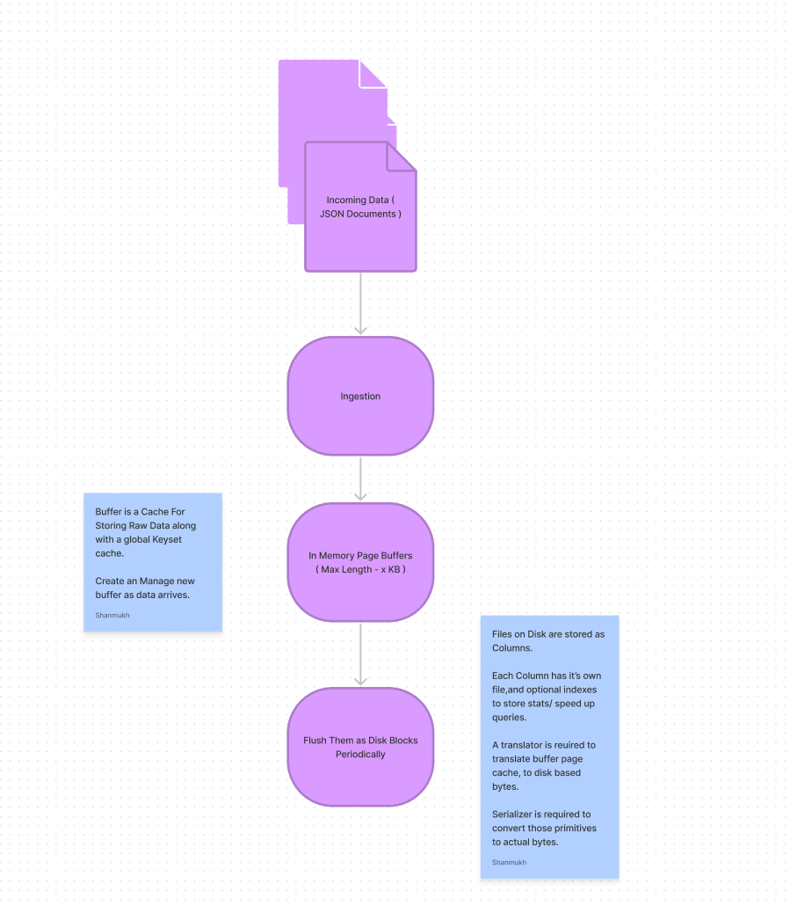

# Goals

This project has been created to understand, and design a high performance column store from scratch. Primary Goals Include

* Petabyte Scale Storage of Unstructured Data. 
* Data Structures for Highly Optimized Reads
* High Throughput Ingestion Streaming API
* Query Engine for Basic Aggregations
* Leverage Vectorized Processing as much as possible. 

## Design

Overall the design is covered in the following sections : 

1. Ingestion API
2. Query Engine
3. Physical Storage Design
4. Reporting API

## Data Ingestion WorkFlow 

## Query Engine

